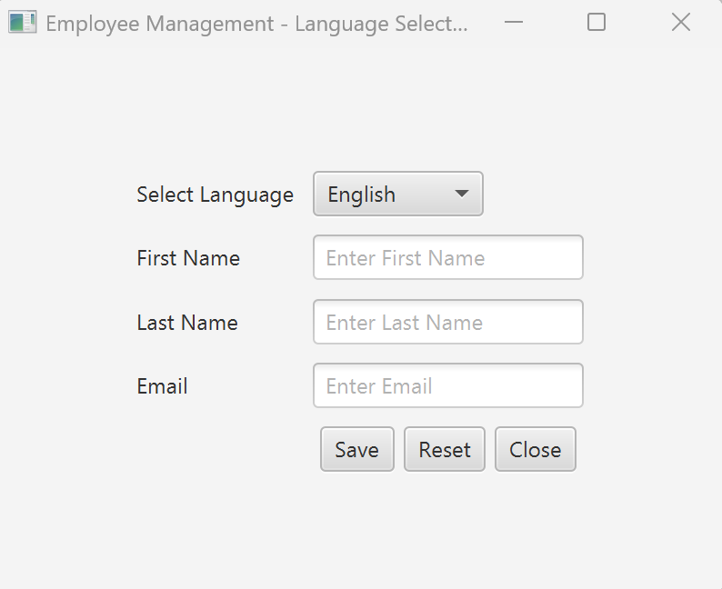
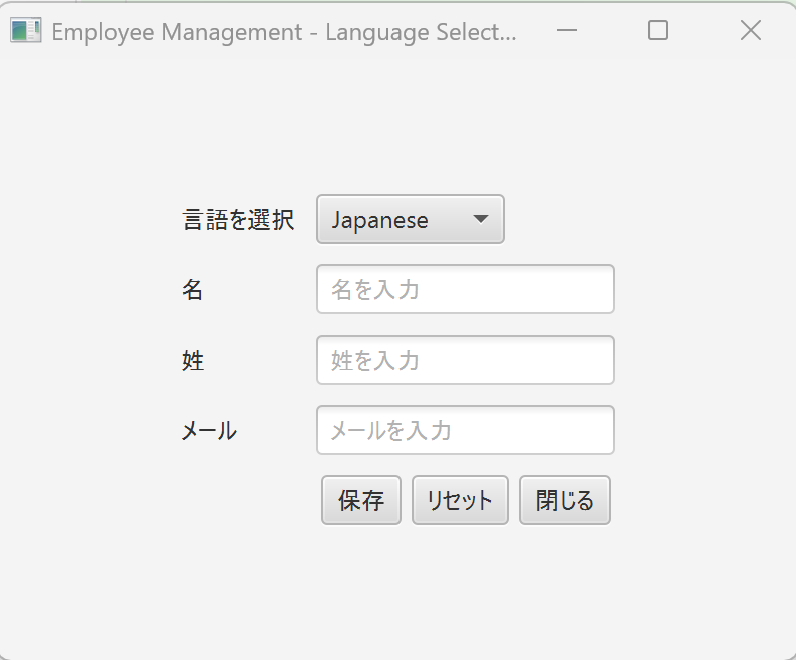

# Field Localization Demonstration

This project demonstrates a JavaFX-based Employee Management application with multilingual support. Users can switch between English, Farsi, and Japanese, which updates the interface labels and messages accordingly. The application also saves employee information to a MySQL database, with tables that store data in different languages.

## Table of Contents
- [Features](#features)
- [Project Structure](#project-structure)
- [Setup Instructions](#setup-instructions)
    - [Prerequisites](#prerequisites)
    - [Installation](#installation)
- [Database Setup](#database-setup)
- [Usage](#usage)
- [Additional Notes](#additional-notes)

## Features
- **Language Selection**: Supports English, Farsi, and Japanese, with dynamic language switching.
- **Employee Management**: Allows adding new employee records to a MySQL database.
- **Secure Configuration**: Loads database credentials securely from `config.properties`.
- **Simple UI**: A JavaFX interface with Save, Reset, and Close buttons for user interactions.

## Project Structure

Below is an overview of the key files and folders in this project:

```
field_localization_demonstration/
├── src/
│   ├── main/
│   │   ├── java/
│   │   │   └── org/example/field_localization_demonstration/
│   │   │       ├── DatabaseUtil.java                # Manages database connection
│   │   │       ├── LanguageSelectionApp.java        # Main application class
│   │   │       ├── LanguageSelectionController.java # Controller for UI actions
│   │   │       └── module-info.java                 # Module declaration for JavaFX and dependencies
│   │   ├── resources/
│   │   │   ├── org/example/field_localization_demonstration/
│   │   │   │   └── language_selection_view.fxml     # JavaFX FXML layout for the app
│   │   │   └── config.properties                    # Database credentials (DB_USER, DB_PASSWORD)
│   │   └── messages/                                # Resource bundle for localization
├── target/                                          # Build files generated by Maven
├── pom.xml                                          # Maven dependencies and build configuration
└── README.md                                        # Project documentation (this file)
```

## Setup Instructions

### Prerequisites
- **Java JDK 22**: Ensure you have JDK 22 installed. [Download JDK](https://jdk.java.net/22/).
- **Maven**: This project uses Maven for dependency management.
- **MySQL**: You need a MySQL server to store employee data.

### Installation

1. **Clone the Repository**

   ```bash
   git clone https://github.com/gitober/field_localization.git
   cd field_localization
   ```

2. **Configure Database Credentials**

   In the `src/main/resources/config.properties` file, set your MySQL credentials:

   ```properties
   DB_USER=yourDatabaseUsername
   DB_PASSWORD=yourDatabasePassword
   ```

## Database Setup

### Create the Database

1. **Create the Database**

   ```sql
   CREATE DATABASE field_localization_demonstration;
   USE field_localization_demonstration;
   ```

   

   *Figure: Database setup in MySQL Workbench*

2. **Create Tables**

   Create tables for each supported language to store localized employee data:

   ```sql
   CREATE TABLE employee_en (
       id INT AUTO_INCREMENT PRIMARY KEY,
       first_name VARCHAR(50),
       last_name VARCHAR(50),
       email VARCHAR(100)
   );

   CREATE TABLE employee_fa (
       id INT AUTO_INCREMENT PRIMARY KEY,
       first_name VARCHAR(50),
       last_name VARCHAR(50),
       email VARCHAR(100)
   );

   CREATE TABLE employee_ja (
       id INT AUTO_INCREMENT PRIMARY KEY,
       first_name VARCHAR(50),
       last_name VARCHAR(50),
       email VARCHAR(100)
   );
   ```

## Usage

- Run the application and select a language from the "Select Language" dropdown.

  *Figure: Language selection screen in English*
  

  *Figure: Language selection screen in Farsi*
  

  *Figure: Language selection screen in Japanese*
  

- Fill in the employee details (first name, last name, email).
- Click **Save** to add the employee details to the database table for the selected language.
- Click **Reset** to clear the form.
- Click **Close** to exit the application.

## Additional Notes

- **Configuration File**: The `config.properties` file contains sensitive information (database credentials). Ensure this file is not exposed publicly.
- **Error Handling**: Alerts are shown for errors such as empty fields or invalid email format. These error messages are also localized.

